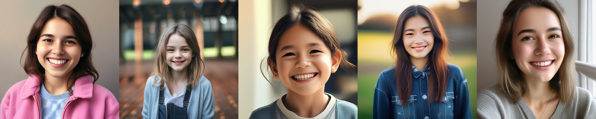
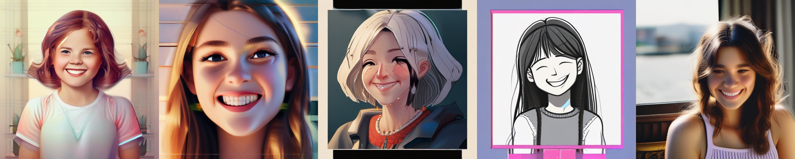

<div align="center">

<h1> ResAdapter: Domain Consistent Resolution Adapter for Diffusion Models  </h1>

<strong> We propose ResAdapter, a plug-and-play resolution adapter for enabling diffusion models of arbitrary style domains to generate resolution-free images: no additional training, no additional inference and no style transfer.</strong>


The above images are generated by ResAdapter with [dreamlike-diffusion-1.0](https://civitai.com/models/1274/dreamlike-diffusion-10)

</div>


## 🔥 Standalone Example with [SDXL-Lightning](https://huggingface.co/ByteDance/SDXL-Lightning)

<div align=center> <strong>[ResAdapter]</strong> The following <strong>512x512</strong> images are generated by ResAdapter with SDXL-Lightning-Step4 </div>

<div align=center> <strong>[Baseline]</strong> The following <strong>512x512</strong> images are generated by SDXL-Lightning-Step4 </div>

<div align=center> Prompt: A girl smiling. </div>

```python
# pip install diffusers, transformers, accelerate, safetensors, huggingface_hub
import torch
from diffusers import StableDiffusionXLPipeline, UNet2DConditionModel, EulerDiscreteScheduler
from huggingface_hub import hf_hub_download
from safetensors.torch import load_file
from torchvision.utils import save_image

generator = torch.manual_seed(12638721376)
width, height = 512, 512

base = "stabilityai/stable-diffusion-xl-base-1.0"
repo = "ByteDance/SDXL-Lightning"
ckpt = "sdxl_lightning_4step_unet.safetensors"  # Use the correct ckpt for your step setting!

# Load SDXL-Lighting.
unet = UNet2DConditionModel.from_config(base, subfolder="unet").to("cuda", torch.float16)
unet.load_state_dict(load_file(hf_hub_download(repo, ckpt), device="cuda"))
pipe = StableDiffusionXLPipeline.from_pretrained(base, unet=unet, torch_dtype=torch.float16, variant="fp16").to("cuda")
pipe.scheduler = EulerDiscreteScheduler.from_config(pipe.scheduler.config, timestep_spacing="trailing")

# Inference SDXL-Lighting
images = pipe(
    "A girl smiling",
    width=width,
    height=height,
    num_inference_steps=4,
    guidance_scale=0,
    num_images_per_prompt=5,
    output_type="pt",
    generator=generator,
).images
save_image(images, f"/baseline_{width}.png", normalize=True, padding=0)

# Load ResAdapter
pipe.load_lora_weights(
    "models/res_adapter/sdxl-i/resolution_lora.safetensors", adapter_name="res_adapter",
)
pipe.set_adapters(["res_adapter"], adapter_weights=[1.0])

# Inference ResAdapter
images = pipe(
    "A girl smiling",
    width=width,
    height=height,
    num_inference_steps=4,
    guidance_scale=0,
    num_images_per_prompt=5,
    output_type="pt",
    generator=generator,
).images
save_image(images, f"resadapter_{width}.png", normalize=True, padding=0)
```


## ⏬ Installation

```bash
# Step1: Enter to res-adapter directory
cd res-adapter

# Step2: Install dependency
pip install -r requirements.txt

# Step3: Download diffusion models, and make the directory structure as follows:
models
├── res_adapter
│   ├── res_adapter-v1.5
│   ├── res_adapter-xl
├── diffusion_models
│   ├── ...
├── controlnet
│   ├── ...
├── ip_adapter
│   ├── ...
└── lcm-lora
    └──  ...
```

## ⏬ Download Models

### 1️⃣ Download ResAdapter


### 2️⃣ Download Diffusion Models

We provide some personalized models for sampling style images with ResAdapter.
More personalized models can be found in [CivitAI](https://civitai.com/).


|Models  | Structure Type |Domain Type |Links |
| --- | --- |--- |--- |
| **Base model**
|SDv1.5 | - | General |[Download](https://huggingface.co/runwayml/stable-diffusion-v1-5)|
|SDXL1.0 |- | General |[Download](https://huggingface.co/stabilityai/stable-diffusion-xl-base-1.0) |
| **Personalized model**
|Dreamlike| SDv1.5 | Fantasy | [Download](https://civitai.com/models/1274/dreamlike-diffusion-10)
|DreamshaperXL|SDXL |2.5D | [Download](https://civitai.com/models/112902/dreamshaper-xl)

### 3️⃣ Download Other Modules

We support demos about ControlNet, IP-Adapter, LCM-LoRA.

|Modules | Name | Type | Links |
| --- |--- | --- | --- |
|ControlNet| lllyasviel/sd-controlnet-canny |SD1.5 | [Download](https://huggingface.co/lllyasviel/sd-controlnet-canny)
|ControlNet| diffusers/controlnet-canny-sdxl-1.0 |SDXL | [Download](https://huggingface.co/diffusers/controlnet-canny-sdxl-1.0)
|IP-Adapter| h94/IP-Adapter | SD1.5/SDXL | [Download](https://huggingface.co/h94/IP-Adapter)
|LCM-LoRA| latent-consistency/lcm-lora-sdv1-5 |SD1.5 | [Download](https://huggingface.co/latent-consistency/lcm-lora-sdv1-5)
|LCM-LoRA| latent-consistency/lcm-lora-sdxl | SDXL| [Download](https://huggingface.co/latent-consistency/lcm-lora-sdxl)

## 🏠 ResAdapter in Inference Scripts

We provide simple scripts for sampling images of resadapter and baseline.

```bash
# Step1: Choose a task example of config file.
# Step2: Run the following script.
python main.py --config /path/to/file
```

### 0️⃣ Best Practice
😄 For better image generation, we provide two advice:
- For text to image tasks, please use personalized models instead of base models.
- For other tasks, use base models.

### 1️⃣ ResAdapter with Diffusion Models

<div align=center> <strong>[ResAdapter]</strong> The following <strong>960x1104</strong> images are generated by ResAdapter with <a href="https://civitai.com/models/4384?modelVersionId=109123">Dreamshaper-7</a>.</div>
<div align=center>

</div>

<div align=center> <strong>[Baseline]</strong> The following <strong>960x1104</strong> images are generated by <a href="https://civitai.com/models/4384?modelVersionId=109123">Dreamshaper-7</a></div>
<div align=center>

</div>

<div align=center> Text to image tasks. 

Prompt: (masterpiece), (extremely intricate), (realistic), portrait of a girl, the most beautiful in the world, (medieval armor), metal reflections, upper body, outdoors, intense sunlight, far away castle, professional photograph of a stunning woman detailed, sharp focus, dramatic, award winning, cinematic lighting, octane render unreal engine, volumetrics dtx, (film grain, blurry background, blurry foreground, bokeh, depth of field, sunset, motion blur), chainmail.</div>


### 2️⃣ ResAdapter with ControlNet

<div align=center> <strong>[ResAdapter]</strong> The following <strong>840x1246</strong> images are generated by ResAdapter with ControlNet(SDv15).</div>
<div align=center>

</div>

<div align=center> <strong>[Baseline]</strong> The following <strong>840x1246</strong> images are generated by ControlNet(SDv15).</div>
<div align=center>

</div>
<div align=center> Image to image tasks. 

Prompt: A bird.</div>


### 3️⃣ ResAdapter with ControlNet-XL

<div align=center> <strong>[ResAdapter]</strong> The following <strong>336x504</strong> images are generated by ResAdapter with ControlNet-XL(SDXL1.0).</div>
<div align=center>

</div>

<div align=center> <strong>[Baseline]</strong> The above <strong>336x504</strong> images are generated by ControlNet-XL(SDXL1.0).</div>
<div align=center>

</div>
<div align=center> Image to image tasks. The first column represents condition image. 

Prompt: A man.</div>

### 4️⃣ ResAdapter with IP-Adapter

<div align=center> <strong>[ResAdapter]</strong> The following <strong>864x1024</strong> images are generated by ResAdapter with IP-Adapter(SDv15).</div>
<div align=center>

</div>

<div align=center> <strong>[Baseline]</strong> The following <strong>864x1204</strong> images are generated by IP-Adapter(SDv15).</div>
<div align=center>

</div>
<div align=center> Face variation tasks. The first column represents face image.</div>


### 5️⃣ ResAdapter with LCM-LoRA

<div align=center> <strong>[ResAdapter]</strong> The following <strong>512x512</strong> images are generated by ResAdapter, LCM-XL-LoRA with <a href="https://huggingface.co/Lykon/dreamshaper-xl-1-0">Dreamshaper-XL.</a></div>
<div align=center>

</div>

<div align=center> <strong>[Baseline]</strong> The following <strong>512x512</strong> images are generated by LCM-XL-LoRA with <a href="https://huggingface.co/Lykon/dreamshaper-xl-1-0">Dreamshaper-XL.</a></div>
<div align=center>

</div>

<div align=center> Text to image task. Step=4, CFG=1.5.

Prompt: portrait, action pose, slow motion, (old male human wizard) old male human wizard wearing yellow and black robes (majestic evoker cloth armor), (wrinkles, steampunk), (archmage robes, runic patterns), (insanely detailed, bloom), (analog), (high sharpness), (detailed pupils), (painting), (digital painting), detailed face and eyes, Masterpiece, best quality, (highly detailed photo), 8k, photorealistic, very long straight white and grey hair, grey streaks, ecstatic, (60-year old Austrian male), sharp, (older body), stocky, realistic, real shadow 3d, (highest quality), (concept art, 4k), (wizard labratory in backgound), by Michelangelo and Alessandro Casagrande and Greg Rutkowski and Sally Mann and jeremy mann and sandra chevrier and maciej kuciara, inspired by (arnold schwarzenegger) and (Dolph Lundgren) and (Albert Einstien)
</div>

